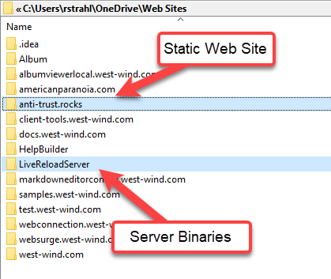
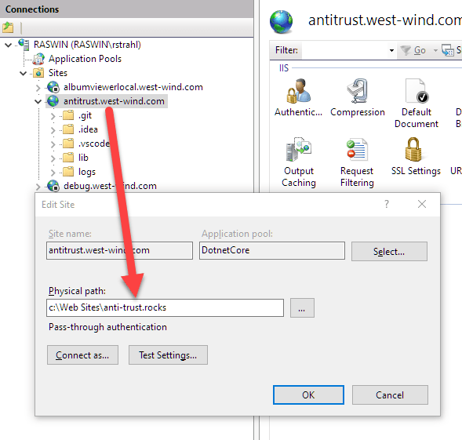

# Live Reload Web Server

[](https://www.nuget.org/packages/LiveReloadServer/) [](https://www.nuget.org/packages/LiveReloadServer/) &nbsp; &nbsp; &nbsp; &nbsp;
[](https://chocolatey.org/packages/livereloadwebserver)


**A self-contained, local, cross-platform, static file Web Server that is based on .NET, with automatic Live Reloading, Markdown rendering and loose Razor Pages** support. The server also supports Web server and standalone hosting for sites using the non-static resource features.


## Features

* **Generic Static File Web Server** you can launch in any folder
* Just start with:
    * `LiveReloadServer <folder>` <small>*(dotnet tool)*</small>  
    * `LiveReloadWebServer <folder>` <small>*(installed version)*</small>
* Support for self-contained **Razor Pages**  <small>*(.cshtml)*</small>
* Themed **Markdown Page Rendering** support built in
* Built-in, optional **Live Reload** functionality for change detection and browser refresh  
  <small>*for all supported file formats: Static Files, Razor and Markdown*</small> 
* Options to customize location, port, files checked etc.
* Easily installed and updated with `dotnet tool -g install LiveReloadServer`
* Run local SPA applications (Angular, VueJs, React etc.)
* Run local Blazor Applications (without Live Reload support however)
* Cross Platform - Windows, Mac, Linux <small>*(dotnet tool only)*</small>
* Serve HTTPS content <small>*(dotnet tool only)*</small>
* **Hostable ASP.NET Core Server** that can be used by multiple sites on a server
* Available as: 
  * Dotnet Tool (cross-platform)
  * Chocolatey Package
  * Self-Contained (Windows) Download

### Links

* [LiveReloadServer v1 Release Post](https://weblog.west-wind.com/posts/2021/Mar/23/LiveReloadServer-A-NET-Core-Based-Generic-Static-Web-Server-with-Live-Reload)


### Requirements:

* Dotnet Tool: .NET 9 SDK
* Hosted: .NET 9  (Asp.Net Runtime)
* Standalone Exe (Windows): self-contained (.NET 9)
* Live Reload in hosted apps requires a Web Server that supports WebSockets
* Older versions of .NET are supported with prior releases
    * <  1.5  -  .NET 8.0
    * <  1.3  -  .NET 7.0
    * <= 1.1  -  .NET 6.0

You can grab the compiled Dotnet Tool from:

* [Dotnet Tool](https://www.nuget.org/packages/LiveReloadServer/)  <small>(windows, mac, linux)</small>  

  ```ps
  dotnet tool install -g LiveReloadServer
  ```
  
* [Chocolatey Package](https://chocolatey.org/packages/LiveReloadWebServer) <small>(windows)</small>

  ```ps
  choco install LiveReloadWebServer
  ```
  
* [Self Contained Windows Executable Folder (zipped)](https://github.com/RickStrahl/LiveReloadServer/raw/master/LiveReloadWebServer-SelfContained.zip) <small>(windows)</small>
* [Hostable Package (requires installed .NET/ASP.NET 9.0 Runtime)](https://github.com/RickStrahl/LiveReloadServer/raw/master/LiveReloadServer-Hosted.zip) <small>(windows, mac, linux)</small>  

> All four versions have the same features and interface, just the delivery mechanism and the executable name is different. The EXE uses `LiveReloadWebServer` while the Dotnet Tool uses `LiveReloadServer`.
  
### What does it do?
This tool is a generic **local Web Server** that you can point to **any folder** and provide simple and quick HTTP access to HTML and other Web resources. You can serve any **static resources** - HTML, CSS, JS etc. Optionally you can also serve **loose Razor Pages** - .cshtml pages that are self-contained with any code contained in the `.cshtml` template. It's also possible to load loose assemblies with custom .NET library code. Additionally there's also optional **Markdown Page Rendering** support with themed HTML templates that render directly from Markdown file to themed page output. 

Live Reload is enabled by default and checks for changes to common static files and also Razor and Markdown files if enabled. If a checked file is changed, the browser's current page is refreshed. Razor pages are recompiled before the refresh. You can map additional file extensions that trigger the Live Reload.

You can also use this 'generic' server behind a live Web Server (like IIS, nginx etc.) by installing the main project as a deployed Web application to provide loose Razor support and Markdown rendering on a Web server. **A  single LiveReloadServer installation can serve many Web sites** using the same static, Razor and Markdown resources which can be ideal for mostly static content sites that need 'a little extra' beyond plain static pages <small>*(examples:  [Anti-Trust Band Site](https://anti-trust.rocks) and [Markdown Monster Product Site](https://markdownmonster.west-wind.com))*</small>.

> Note: This hosting feature isn't meant to be a replacement for full ASP.NET Web sites. If you have complex logic beyond simple scripting  or displaying easily managed local content, a full Web site will offer a better development experience. BUt if you just need a few small features or some easy script code to render some output the hosting feature is a quick way to push-button deploy individual HTML pages and their dependencies.

## Installation
Live Reload Server can be installed as:

* A dotnet tool using .NET SDK *(cross-platform)*
* From Chocolatey as a self-contained Executable *(Windows)*
* Downloaded self-contained or shared runtime install *(Windows)*
* Hosted Package in a Web Server *(cross-platform)*

### Dotnet Tool
If you are a .NET developer and are already using the .NET SDK this is the easiest way to use this tool and it works on all platforms .NET is supported on:

```powershell
dotnet tool install -g LiveReloadServer
```

To use it, navigate to a folder that you want to serve HTTP files out of:

```ps
# will serve current folder files out of http://localhost:5200
LiveReloadServer

# specify a folder instead of current folder and a different port
LiveReloadServer "c:/temp/My Local WebSite" --port 5350 -UseSsl

# Customize some options
LiveReloadServer --LiveReloadEnabled False --OpenBrowser False -UseSsl -UseRazor
```

### Chocolatey
You can also install from Chocolatey on Windows:

```ps
choco install LiveReloadWebServer
```

To use it then use:

```ps
LiveReloadWebServer "c:/temp/My Local WebSite" --port 5350 -UseSsl
```

> Note that EXE filename is `LiveReloadWebServer` which is different from the Dotnet Tool's ` LiveReloadServer` so they can exist side by side without conflict.
>
> Any of the following examples use `LiveReloadServer`, and you should substitute `LiveReloadServer` with `LiveReloadWebServer` for any non dotnet tool  installations.

### Self-Contained EXE or Shared Runtime Installs
You can also download the self-contained binaries directly into a folder and run locally on Windows. The application installs into a folder and runs as console application. Invoke directly or add your path to the folder to launch the console app.

> This version can also be used in a hosted environment (see next section)

[Download and Install Self (Windows)](https://github.com/RickStrahl/LiveReloadServer/raw/master/LiveReloadWebServer-SelfContained.zip)

To launch with a full path:

```ps
# Use your install folder
~\MyPrograms\LiveReloadServer\LiveReloadWebServer c:\Web Sites\MyStaticSite -useSsl -useRazor
```

### Shared Runtimes and Hosted Install
The Shared Runtime install requires that the .NET and ASP.NET Runtimes are installed. Using this install is smaller and works identical tot he self-contained install. 

In addition it can also be hosted in a Web server to provide Razor, Markdown and LiveReload services to Web sites. In order to host you'll need to map the binaries to a Web site and you can use .NET configuration or Environment variables to set startup parameters to point at the Web site folder.

For IIS this looks like this:

```xml
<system.webServer>
   <handlers>
     <add name="aspNetCore" path="*" verb="*" modules="AspNetCoreModuleV2" resourceType="Unspecified" />
   </handlers> 
   <!-- point at the DLL with absolute or relative path -->
   <aspNetCore processPath="dotnet" hostingModel="InProcess" arguments="..\LiveReloadServer\LiveReloadServer.dll" stdoutLogEnabled="false" stdoutLogFile=".\logs\stdout">
     <environmentVariables>
       <!-- set launch options for the site  -->
       <environmentVariable name="ASPNET_ENVIRONMENT" value="Production" />
       <environmentVariable name="LIVERELOADSERVER_WEBROOT" value="C:\users\rstrahl\OneDrive\Web Sites\anti-trust.rocks" />
       <environmentVariable name="LIVERELOADSERVER_USERAZOR" value="True" />
       <environmentVariable name="LIVERELOADSERVER_USEMARKDOWN" value="True" />
       <environmentVariable name="LIVERELOADSERVER_USELIVERELOAD" value="False" />
       <environmentVariable name="LIVERELOADSERVER_OPENBROWSER" value="False" />           
       <environmentVariable name="LIVERELOADSERVER_SHOWCONSOLEOUTPUT" value="False" />     
       <environmentVariable name="LIVERELOADSERVER_DEFAULTFILES" value="index.html,post.md,readme.md" />        
     </environmentVariables>
   </aspNetCore>
</system.webServer>
```

You can map multiple sites to a single executable in this way. It's possible to do this both with the Self-Contained and Shared Runtime installs.

### Open Folder as LiveReload Web Site Shell Extension (Windows)
You can optionally add LiveReloadServer (or LiveReloadWebServer) install as a shell extension that offers to open a folder as a Web site:


To register and unregister this functionality, you can use these command line options:

* LiveReloadServer --RegisterExplorer
* LiveReloadServer --UnregisterExplorer

> [!TIP]
You can tweak default start up settings for LiveReloadServer by editing the the `LiveReloadWebServer.json` configuration files. Use `LiveReloadServer -opensettings` to open the file for editing.


## Launching the Web Server
You can use the command line to customize how the server runs. By default files are served out of the current directory on port `5200`, but you can override the `WebRoot` folder.

Use command line parameters to customize:

```ps
LiveReloadServer "c:/temp/My Web Site" --port 5200 -useSsl -openEditor
```

There are a number of Configuration options available:

```text
Syntax:
-------
Syntax:
-------
LiveReloadServer <WebRoot> <options>

--WebRoot                <path>  (current Path if not provided)
--Port                   0*|5210  0* - use next available port >= 5200
                                  n  - force a specific port number)
--Host                   0.0.0.0*|localhost|custom Ip - 0.0.0.0 allows external access
--UseSsl                 True|False*
--UseRazor           True|False*

--UseLiveReload          True*|False
--Extensions             ".cshtml,.css,.js,.htm,.html,.ts"*
--DefaultFiles           "index.html,default.htm"*
--FolderNotFoundFallbackPath
                         "Fallback Url on 404 folder requests (none* or "index.html")"

--ShowUrls               True|False*
--OpenBrowser            True*|False
--BrowserUrl             optional startup URL (relative or absolute)
--OpenEditor             True|False*
--EditorLaunchCommand    "code \"%1\""* (Win)
                         "open - a \"Visual Studio Code\" \"%1\""* (Mac)
--DetailedErrors         True*|False
--ShowConsoleOutput      True*|False (turn off for production)
--Environment            Production*|Development
--VirtualPath            / | /docs/ | /myApp/docs/  (default is root /)

Razor Pages:
------------
--UseRazor              True|False*

Markdown Options:
-----------------
--UseMarkdown           True|False*
--CopyMarkdownResources True|False*
--MarkdownTemplate      ~/markdown-themes/__MarkdownTestmplatePage.cshtml*
--MarkdownTheme         github*|dharkan|medium|blackout|westwind
--MarkdownSyntaxTheme   github*|vs2015|vs|monokai|monokai-sublime|twilight

System
------
-RegisterExplorer       Registers Folder Shell Context Menu
-UnRegisterExplorer     Unregisters Shell integration
-OpenSettings           Opens default Configuration Settings in an editor as Json

Options can be specified in this order in:

* Configuration File
* Environment Variables with 'LIVERELOADSERVER_' prefix. Example: 'LIVERELOADSERVER_PORT'
* Command Line options as shown above
* Logical Command Line Flags for true can be set like: -UseSsl or -UseRazor or -OpenBrowser


Examples:
---------
LiveReloadServer "c:\temp\My Site" -useSsl -useRazor
LiveReloadServer --WebRoot "c:\temp\My Html Site" --port 5500 -useSsl -openEditor

$env:LiveReloadServer_Port 5500
$env:LiveReloadServer_WebRoot c:\mySites\Site1\Web
LiveReloadServer
```


> LiveReloadServer is optimized for local development operation, so many of the flags default to settings that are geared towards quickly getting a site opened and running. All of these default options can be disabled with switches.


### Default Configuration Settings
If you run `LiveReload` or `LiveReloadWebServer` without any parameters, the app starts with its default settings. You can tweak these default settings via the configuration file which can be found in the installation folder or which you can open with `LiveReloadServer -opensettings`. You can edit the values in this Json file, to modify the default startup behavior.

By default LiveReloadServer without switches:

* Opens the current folder (or the folder pointed to by the Shell Extension)
* Runs on port 5200 or the next available higher port if already in use (--port 0)
* Doesn't use: Secure Connection, Razor or Markdown
* Handles common static Web resource extensions and Mime types
* Live Reload is enabled

All of the command line switches shown above can be adjusted in the configuration file and then become the startup default.

The order of settings are loaded is:

* Default internal configuration
* Configuration File (`LiveReloadWebServer.json`)
* Environment Variables (`LIVERELOADSERVER_SettingName`)
* Command Line Switches

## Static Files
The Web Server automatically serves all static files and Live Reload is enabled by default unless explicitly turned off. HTML pages, CSS and scripts, and any other specific files with extensions you add are automatically reloaded whenever you make a change to the files.

You can add extensions using the `--Extensions` switch. The default is: `".cshtml,.css,.js,.htm,.html,.ts,.md"`. If you rather work without Live Reload you can turn it off via `--useLiveReload False`.

`BrowserUrl` is an optional flag that allows you to specify a specific URL to open on launch. By default the root site is opened - by specifying a URL you can open a specific page. The `BrowserUrl` can be an absolute URL (`https://localhost:5200/test.html`) or a relative URL (`/test.html` or `test.html` or `/subfolder/test.html`). You can disable browser opening with `--OpenBrowser false`.

## SSL Support (--useSsl)
If you're using the `dotnet tool` and are .NET SDK you can easily enable SSL on the local site by using the `--useSsl` switch. This will run the local site in `https://` mode with the install dev certificate of the SDK.

If the SDK dev certificates are not installed you can install them with:

```ps
dotnet dev-certs https --trust
```

> The only way to use --useSsl at the moment is via the built-in .NET dev certificates. If you're running the standalone versions and you want to run with `https://` you have to install the .NET SDK to get the certificates installed.


## Markdown File Rendering
You can enable Markdown support in this server by setting `-useMarkdown`. This serves HTML content directly off any `.md` or `.markdown` files in the Web root. The server provides default templates for the HTML styling, but you can override the rendering behavior with a **custom Razor template** that provides the chrome around the rendered Markdown, additional styling and syntax coloring.

This can be very useful if you are building documentation Web sites, so you can easily 'run' the documentation and see the Markdown rendered. Because `.md` files are effectively mapped you can even navigate naturally between Markdown pages if they are linked in the Markdown as is often the case for GitHub doc. 

And a real useful feature: **Changes in Markdown also auto-refresh as soon as you change the markdown**.

If you make a change to the Markdown document, the browser is refreshed and immediately shows that change if you are viewing the Markdown page. If you create a custom Markdown Razor template, changes in that template (or the original if you use that) are also detected and cause an immediate refresh.

Markdown support is not enabled by default and has to be turned on via the `--UseMarkdown True` command line switch. Once set any `.md` in the browser either by the `.md` or simply without an extension. Additional Markdown extensions to monitor can also be added.
  
To access `README.md` in the WebRoot you can use:

* https://localhost:5200/README.md  
* https://localhost:5200/README

### Customizing Markdown Templates and Styling
Default styling for Markdown comes from a Razor template that is provided as part of the distribution in the install folder's `./templates/markdown-themes` directory. This folder is hoisted as `~/markdown-themes` into the Web site, which makes the default CSS and script resources available to the Web site. This folder by default is routed back to the launch (not Web) root and is used for all sites you run through this server.

There are several ways you can customize the Markdown styling and supporting resources:

* Copy the existing `markdown-themes` folder into your Web root and modify
* Create and point to a custom Razor template in your site

### Copy the Existing `markdown-themes` Folder
You can copy the `markdown-themes` folder into your Website either manually or more easily via the `--CopyMarkdownResources True` command line flag. When you use this flag, the `markdown-themes` folder will be copied from the launch root into your Web root **if it doesn't exist already**. 

Once moved to the new location in your web root folder, you can modify the `__MarkdownPageTemplate.cshtml` page and customize the rendering. For example, you can add a Layout page (if Razor support is enabled) to add site wide styling or you can modify the page theme and syntax coloring theme.

More on customization below.

### Using a custom Markdown Template
The template used for Markdown rendering is an MVC View template that is passed a `MarkdownModel` that contains the rendered markdown and a few other useful bits of information like the path, file name and title of the document. 

You can override the template used by using the `--MarkdownPageTemplate` command line switch:

```ps
LiveReloadServer ./website/site1 -UseMarkdown --MarkdownPageTemplate ~/MyMarkdownTemplate.cshtml
```

> Note although you can completely replace the stock template, keep in mind that there's a bit of styling and scripts are required in order to render Markdown. For example, code snippets coloring needs a JavaScript library and text styling may require some custom CSS. It'll render without but it won't look pretty without a bit of styling.

To give you an idea what a template should look like, here's the default template:

```html
@model Westwind.AspNetCore.Markdown.MarkdownModel
<html>
<head>
    @if (!string.IsNullOrEmpty(Model.BasePath))
    {
        <base href="@Model.BasePath" />
    }
    <title>@Model.Title</title>
    <!-- *** Markdown Themes: Github, Dharkan, Westwind, Medium, Blackout -->
    <link rel="stylesheet" href="~/markdown-themes/Dharkan/theme.css" />
    <link rel="stylesheet" href="~/markdown-themes/scripts/fontawesome/css/font-awesome.min.css" />
    <style>   
        pre > code {
            white-space: pre;
        }
    </style>
</head>
<body>
    <div id="MainContent">        
        @Model.RenderedMarkdown
    </div>

    <script src="~/markdown-themes/scripts/highlightjs/highlight.pack.js"></script>
    <script src="~/markdown-themes/scripts/highlightjs-badge.min.js"></script>
    
<!-- *** Code Syntax Themes: vs2015, vs, github, monokai, monokai-sublime, twilight -->
<link href="~/markdown-themes/scripts/highlightjs/styles/vs2015.css" rel="stylesheet" />
    <script>
        setTimeout(function () {
            var pres = document.querySelectorAll("pre>code");
            for (var i = 0; i < pres.length; i++) {
                hljs.highlightBlock(pres[i]);
            }
        });

    </script>
</body>
</html>
```

The model is passed as `MarkdownModel` and it contains the `.RenderedMarkdown` property which is the rendered HTML output (as an `HtmlString`). There's also the `.Title` which is parsed from the document based on a header if present. The model also contains the original Markdown and a YAML header if it was present.

### Default Theme Overrides
If you stick with the default theming you can override:

* The overall render theme 
    ```html
    <!-- *** Markdown Themes: Github, Dharkan, Westwind, Medium, Blackout -->
    <link rel="stylesheet" href="~/markdown-themes/Dharkan/theme.css" />
    ```    
* The syntax coloring
    ```html
    <!-- *** Code Syntax Themes: vs2015, vs, github, monokai, monokai-sublime, twilight -->
    <link href="~/markdown-themes/scripts/highlightjs/styles/vs2015.css" rel="stylesheet" />
    ```

### Completely Custom CSS Markup
You can create any HTML and CSS to render your Markdown of course if you prefer. The `markdown-themes` themes can give you a good start of things that you typically have to support in Markdown content so they offer a good starting point for your own themes. Pick a theme and customize, or if you are keen - go ahead and start completely clean.

## Razor Files
LiveReloadServer has **basic Razor Pages support**, which means you can create **single file, inline Razor content in Razor pages** as well as use Layout, Partials, ViewStart etc. in the traditional Razor Pages project hierarchy. As long as **all code is inside of `.cshtml` Razor pages** all of Razor's features are supported.

> #### Slow First Time Razor Startup
> First time Razor Page startup can be slow. Cold start requires the Razor Runtime to load the compiler and related resources so the very first page hit can take a few seconds before the Razor page renders. Subsequent page compilation is faster but still 'laggy' (few hundred ms), and previously compiled pages run very fast at pre-compiled speed.

### No Compiled C# Code
However, there's **no support for code behind razor models** or  **loose C# `.cs` file compilation** as runtime compilation outside of Razor is not supported. All dynamic compilable code has to live in Razor `.shtml` content.

### Load External Code
Although LiveReloadServer supports code only directly in Razor pages, it is possible to load external libraries in two ways:

* NuGet Packages in `PrivateBin\NugetPackages.json`
* Loose Assemblies in `PrivateBin`

### NuGet Package Support
It's possible to load *public* NuGet packages  from the official NuGet feed by adding packages to load to a 

The configuration lives in a `./PrivateBin/NuGetPackages.json` file in your WebRoot that looks like this:

```json
{
    "Packages": [
        {
            "packageId": "Westwind.Ai",
            "version": "0.2.4.2"
        },
        {
            "packageId": "Humanizer.Core",
            "version": "2.14.1"
        },
        
    ],
    "Sources": [
        "https://api.nuget.org/v3/index.json", 
        "./SupportPackages",
        "d:\\Projects\\NuGet"
    ]
}
```

The `Sources` collection can be empty or null, and it will default to the default NuGet feed. Otherwise you can specify a repository Url, or a local folder path. Relative paths are relative to the `WebRoot` folder.

Packages for the appropriate runtime are downloaded and installed in `./Private/Nuget` folder in your `WebRoot` folder, using standard NuGet path expansion with target and framework sub-folder hierarchy. Dependencies are pulled and also loaded.

Libraries imported can be referenced explicitly using the assembly types, so they don't require Reflection to access.

> Make sure the `<WebRoot>/PrivateBin/NuGet` has write access when loading assemblies for the first time as they are downloaded and then saved in that folder. For distribution we recommend you provide the folder as part of your application to avoid downloading on startup in which case permissions won't be required.

#### External Assembly Support
You can also explicitly import loose .NET assemblies by adding them to the `./PrivateBin` folder in your WebRoot.

You can add **external assemblies** by adding final dependent assemblies (not NuGet packages!) into a `./privatebin` folder below your WebRoot folder. Assemblies in this folder will be loaded when the site is launched and become available for access in your Razor page code.

## Error Page Display
There are two ways you can display error information:

* Use the default ASP.NET Developer Error Page
* Use a custom Error Page

Both require that you explicitly create a `/Error.cshtml` file.

LiveReloadServer by default use ASP.NET Developer error page as this server is primarily meant as a development server. You can disable that behavior by using the `--DetailedErrors False` flag which triggers the `/Error.cshtml` page. 

> Note: If you don't have an `/Errors.cshtml` file any compilation or runtime errors in the server will result in a `404` error as it tries to redirect to the `/error` route that doesn't exist.

> If you host your server in IIS or another Web Server, make sure to set the `LIVERELOADSERVER_DETAILEDERRORS` value to `false` to avoid displaying a developer error page to users.

### Developer Error Page
The developer error page is internal to ASP.NET, but unfortunately it still requires a physical `/Error.cshtml` in order for the routing to fire properly.

A minimal page looks like this (or you can copy the code from a stock Razor Pages application by combining everything into a single file.)

The minimal error page looks like this:

```html
@page
<h1>An error occurred</h1>
@function {
   // IMPORTANT: must have a function block in order for error page to work!
}
```

> This page is never actually displayed, but **it has to have that `@function { }` section** in order to work.

The default error page is very detailed and works well for development environments, but if you plan on using LiveReloadServer for some sort of production app you probably want to run with `--DetailedErrors False`.

### Custom Error Page
If you want to create custom error page you can create a custom `Error.cshtml` page which uses the standard ASP.NET error behavior.

You can create an error page and return error information like this using the HttpContext features to retrieve an `IExceptionHandlerPathFeature`

```html
@page

<html>
<body>
<h1>Razor Pages Error Page</h1>
<hr/>
<div style="font-size: 1.2em;margin: 20px;">
    Yikes. Something went wrong...
</div>
@{
            var errorHandler = HttpContext
                .Features
                .Get<Microsoft.AspNetCore.Diagnostics.IExceptionHandlerFeature>();
}
<hr/>
@if(errorHandler != null )
{
            var error = errorHandler.Error;
            var message = error?.Message;
            if (message == null)
              message = "No Errors found.";

            <text>            
            @message     
            </text>

            <pre>
            @error?.StackTrace
            </pre>
}
</body>
</html>
```

> @icon-info-circle Set Development Environment
> Note you can set the Development Environment by setting the `LIVERELOADWEBSERVER_ENVIRONMENT` variable to `Production` or `Development`. In Development mode it will show the error information above. The default is production.

## Using Razor Features
To serve a Razor page create a page that uses some .NET code using C# Razor syntax. For example here's a `hello.cshtml`:

```html
@page
<html>
<body>
<h1>Hello World</h1>

<p>Time is: @DateTime.Now.ToString("hh:mm:ss tt")</p>

<hr>

@{
    var client = new System.Net.WebClient();
    var xml = await client.DownloadStringTaskAsync("https://west-wind.com/files/MarkdownMonster_version.xml");
    var start = xml.IndexOf("<Version>") + 9;        
    var end = xml.LastIndexOf("</Version>");
    var version = xml.Substring(start, end - start);
}

<h3>Latest Markdown Monster Version: @version</h3>
<hr>

</body>
</html>
```

Assuming you place this into the `--WebRoot` folder that's the root you can then access this page with:

```
http://localhost:5200/hello
```

Note it's the name of the Razor Page **without the extension**. If you create the `.cshtml` in a sub-folder, just provide the path name:

```
http://localhost:5200/subfolder/hello
```

Same as you would expect with Razor Page in full ASP.NET Core applications.

I want to stress though, that this is a limited Razor Pages implementation that is not meant to substitute for a full ASP.NET Core Razor Application. Since there's no code behind compilation or ability to create loose classes that are compiled at runtime.

The only external code mechanism is via the External Assembly import from `./privatebin` mentioned above.

### Files and Folder Support
As mentioned above you can use most Razor Pages file based constructs like _Layout and Partial pages, ViewStart as well as shared folders etc. The root folder works like any other Razor Pages folder or Area in ASP.NET Core and so all the relative linking and child page access are available.


### Non-Razor Page Code is not supported
The following code execution features are not available:

* No code behind model code (.cs)
* No compiled source code files (.cs)

You can however load external assemblies by placing assemblies in `./privatebin` of the web root.

I want to stress that LiveReloadServer is not meant to replace RazorPages or a full ASP.NET Core application - it is meant as a local or lightweight static site Web Server with 'benefits' of some dynamic code execution. But it's not well suited to building a business application!

### Load External Assemblies
It's also possible to pull in additional assemblies that can then be accessed in the Razor Pages. To do this:

* Create a `./privateBin` folder in your specified WebRoot folder
* Add any **assemblies** and their dependencies there

You have to use **assemblies** rather than NuGet packages and you are responsible for adding all required dependencies in the `./privatebin` folder in order for the application to run. For example, if I wanted to add `Westwind.AspNetCore.Markdown` for Markdown features I can add the `Westwind.AspNetCore.Markdown.dll`. However, that dll also has a dependency on `Markdig.dll` so that assembly has to be available in the `./PrivateBin` folder as well.

Finding all dependencies may be tricky since NuGet doesn't show you all `dll` dependencies, so this may require some sleuthing in a project's `project.dep.json` file in a `publish` folder.


### Use Cases for a Static Server with Benefits
Some things you can do that are useful:

* Update a Copyright notice year with `2017-@DateTime.Now.Year`
* Read authentication values
* Check versions of files on disk to display version number for downloads
* Implement Server Side SEO Friendly Page Routing
* Download content from other Web sites to retrieve information or text

All these things use intrinsic built-in features of .NET or ASP.NET which, while limited to generic functionality, are still very useful for simple scripting scenarios.

Also keep in mind this is meant as a generic **local** server and although you can host this generic server on a Web site, the primary use case for this library is local hosting either for testing or for integration into local (desktop) applications that might require visual HTML content and a Web server to serve local Web content.

### Blazor WASM Support
It is possible to run client side Blazor applications with this Web server, but there will be no live-reload functionality since a live Blazor application is pre-compiled. It is however possible to run Blazor with a couple of configuration settings.

Set the following two settings in the server's `LiveReloadWebServer.json` file to enable Blazor:

```json
"LiveReload": {
    ...
    "AdditionalMimeMappings": {
      ".dll": "application/octet-stream"
    },
    "FolderNotFoundFallbackPath":  "/index.html"
}
```

The first setting ensures that `.dll` files for .NET assemblies can be served by the LiveReload server. By default these are not enabled.

The second setting ensures that you can **refresh a client side page** which forces a server refresh. The page will rewrite the current 404 request by accessing the specified URL which typically will be `/index.html`. Since the URL stays the same the Blazor page should then navigate then to the desired client side URL on refresh.

### SPA Client Side Routing Fallback: FolderNotFoundFallbackPath
If you're using this server against a SPA application that uses **client side routing**, you may need to enable server side route fallback for extensionless Urls, so that client side routes not handled by the server can be served by the SPA home page - typically `index.html` - as a client side route. This is done via the `--FolderNotFoundFallbackPath` configuration switch which points to the SPA start URL. 

By default this value is `null` and an invalid folder route causes a `404 - Not Found` response. But you can set this setting to a local url like `/index.html` or `/404NotFound.html`

When this setting is enabled any extensionless URL fired against the server that isn't handled serves up the specified site relative Url.

You can do this with:

```json
"LiveReload": {
    ...
    "FolderNotFoundFallbackPath":  "/index.html"
}
```

or by starting with the `--FolderNotFoundFallbackPath /index.html` command line switch. With this flag in place a URL like this:

```text
https://albumviewer.west-wind.com/albums
```

If fired on the server automatically serves the content of `/index.html`. This allows the client side application to run **and** maintain the original client side path of `/albums` so that it can route to the correct page.


## Running LiveReloadServer in a Web Server
If you are working strictly with static files on your Web site, there's no need to have a deploy LiveReloadServer. However, if you're using the dynamic features of the LiveReloadServer - RazorPages or Markdown Rendering - these features require that LiveReloadServer is available for processing requests on a production server.

LiveReloadServer is an ASP.NET Core application and as such can also run behind a live Web Server like IIS or nginX. LiveReloadServer is distributed as a `dotnet tool` or a standalone exe, but we also provide a hostable package you run like any other ASP.NET Core application. This can be useful if you need to simple Razor Page content or Markdown display features.

To do this:

* Download the integrated server [binaries from GitHub](https://github.com/RickStrahl/LiveReloadServer/blob/master/LiveReloadServer-Hosted.zip)
* Install the files into a new folder
* Configure Web site's `web.config` to point .NET Core binary

### Installing on IIS
Let's go through this with IIS which uses the ASP.NET Core Hosting module. Make sure whatever server you're using .NET Core 5.x or later is installed. On IIS you need [ASP.NET Core Windows Server Hosting Bundle](https://dotnet.microsoft.com/en-us/download/dotnet/9.0).

Start by downloading the hosted binaries and unzip into a folder - I use `LiveReloadServer` in my `Web Sites` folder. The Web Site goes into a separate folder `anti-trust.rocks` using only the static files that make up the Web site's content.



Next set up a new Web Site (or virtual in IIS) and point it at this new folder. You'll want to use a separate Application Pool as IIS can only host a single .NET Core app in an Application Pool. Remove ASP.NET Framework support from the Application Pool to reduce overhead.



Finally you need to configure the site to point at the Web folder and set any custom settings you want to run the site, like enabling Markdown and Razor etc. For IIS you do this via the `web.config` file in the Web folder:

```xml
<?xml version="1.0" encoding="utf-8"?>
<configuration>
  <location path="." inheritInChildApplications="false">
    <system.webServer>
      <handlers>
        <add name="aspNetCore" path="*" verb="*" modules="AspNetCoreModuleV2" resourceType="Unspecified" />
      </handlers>
      <aspNetCore processPath="dotnet" arguments="../LiveReloadServer/LiveReloadServer.dll" stdoutLogEnabled="true" stdoutLogFile=".\logs\stdout" hostingModel="inprocess">
        <environmentVariables>
          <environmentVariable name="ASPNET_ENVIRONMENT" value="Production" />
          <environmentVariable name="LIVERELOADSERVER_WEBROOT" value="C:\Web Sites\anti-trust.rocks" />
          <environmentVariable name="LIVERELOADSERVER_USERAZOR" value="True" />          
          <environmentVariable name="LIVERELOADSERVER_USELIVERELOAD" value="False" /> 
        </environmentVariables>
      </aspNetCore>
    </system.webServer>
  </location>
</configuration>
```


Notice that I'm using a relative path for Server application - you can also specify a full path if necessary. Note that multiple Web sites can share the single server instance, with each pointing their private `web.config` at the shared `LiveReloadServer` folder and `dll`.

## More Features?
The primary goal of LiveReload server is as a local server, not a hosted do-it-all Web Server solution, but for 'static site with privileges' scenarios it works very well.

Other features may be explored but at the moment the feature set is well suited to the stated usage scenario I intended it for.

More features like dynamic compilation of loose C# code files at runtime might be possible in this generic server, but currently that has not been explored. Personally I think this goes against the simplicity of this solution. If you really have a need for complex code that requires breaking out of Razor Page script code, it's time to build a full ASP.NET Core RazorPages application instead of using this server. 


If that's of interest to you or you want to contribute, please file an issue to discuss and explore the use cases and what might be possible.

## Version History

* [Live Reload Server Change Log](Changelog.md)